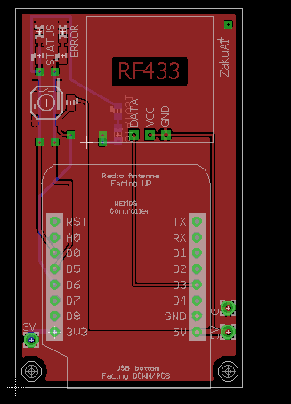
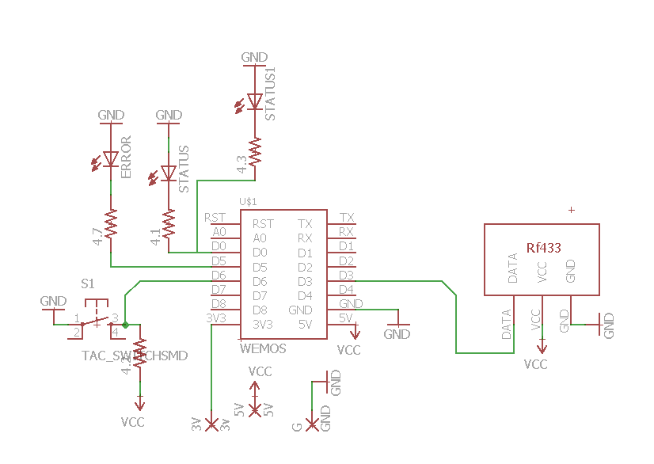
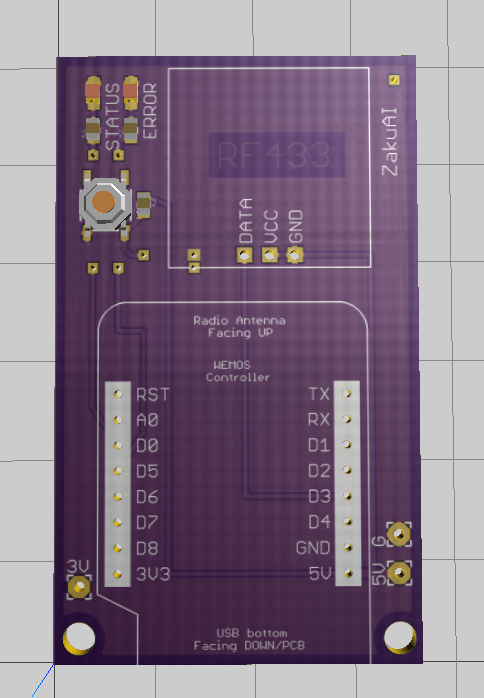
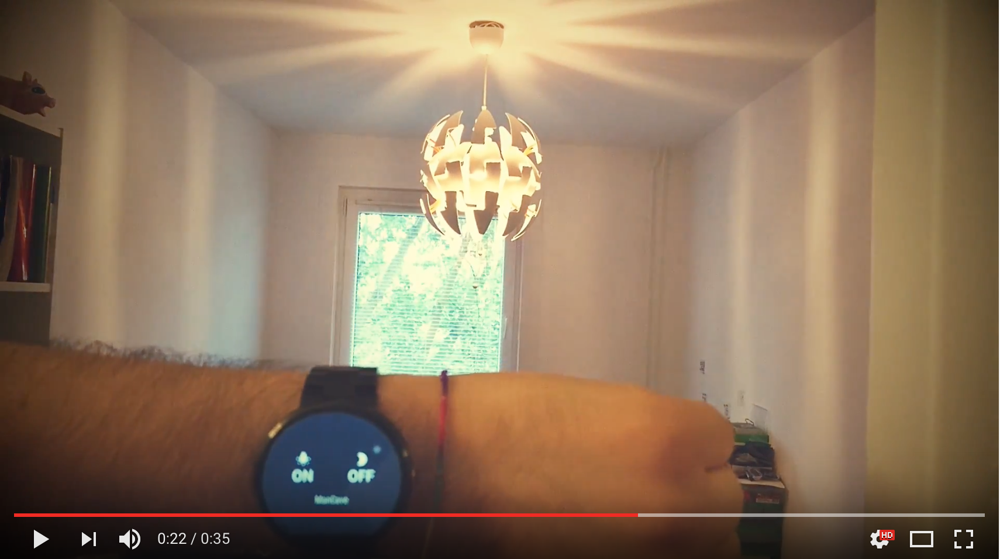

# hardware-iot-home-control

**Files**

Contains Eagle files for the board design

**Description**

Controlling sub GHz (433 MHz) electronic switches in the house with mobile &amp; wearable app.

**Other project parts**

Android part of the project [**repo**](https://github.com/bernardpletikosa/android-iot-home-control)

Server part of the project [**repo**](https://github.com/SmbatYeranyan/nodejs-iot-home-control)

**Board**

**Showcase video**

